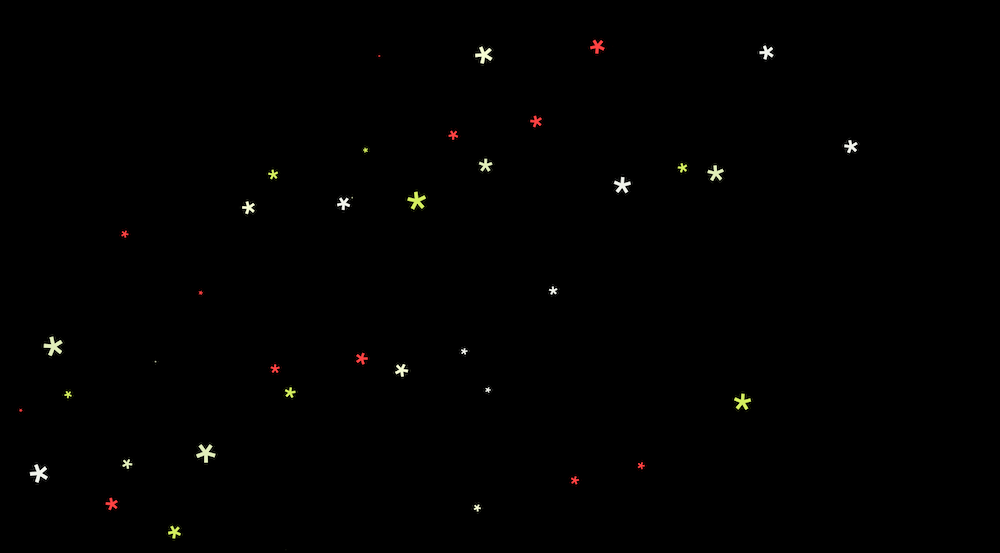
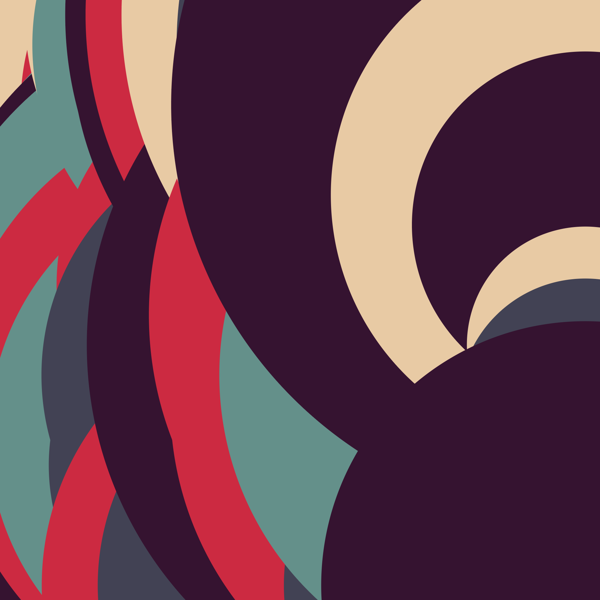
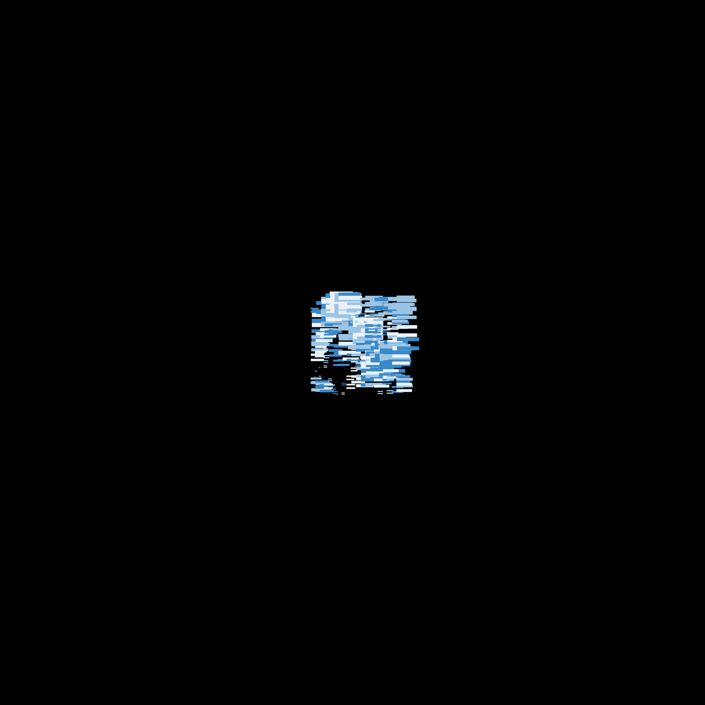
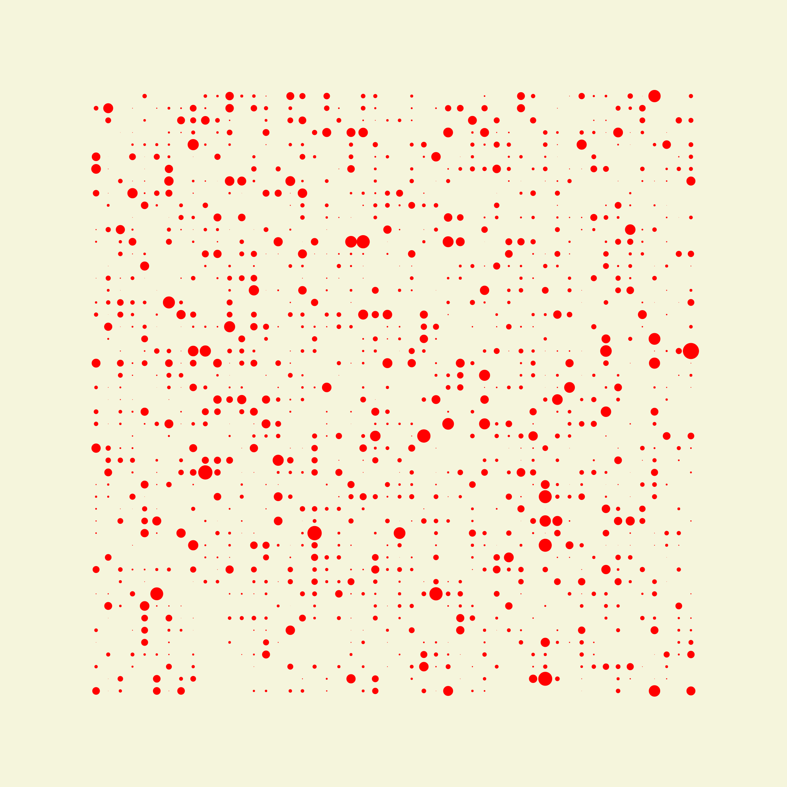

# Canvas playground

Repo dedicated to canvas learning, for now following [Matt Deslauriers awesome course and Canvas and WebGL on frontendmasters.com](https://frontendmasters.com/courses/canvas-webgl/) ! 🙃

## This repo

Every folder contains a sketch and the code the generate it.

## Int

```bash
npx canvas-sketch-cli
canvas-sketch [file.js]
```

Runs a server with the file's canvas displayed.

## Some images I've made

With a lot of fun !






