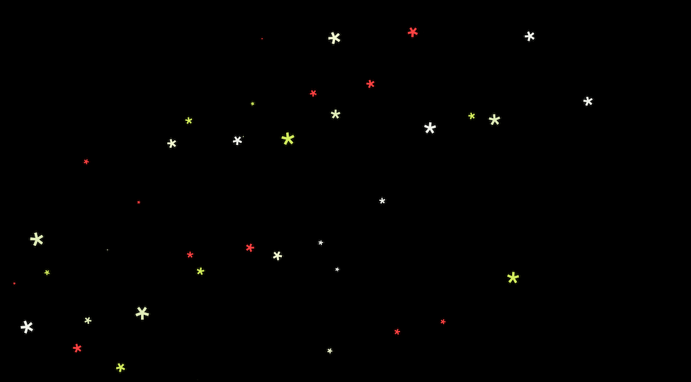
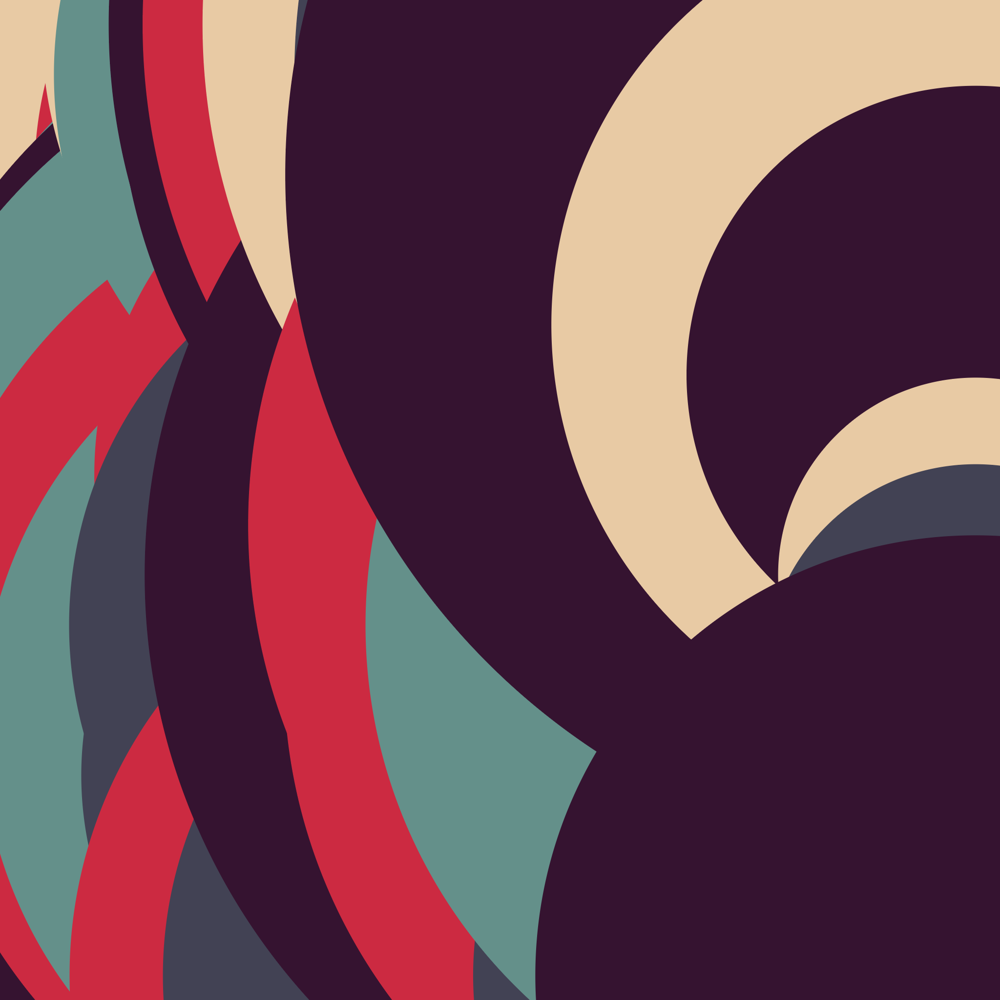
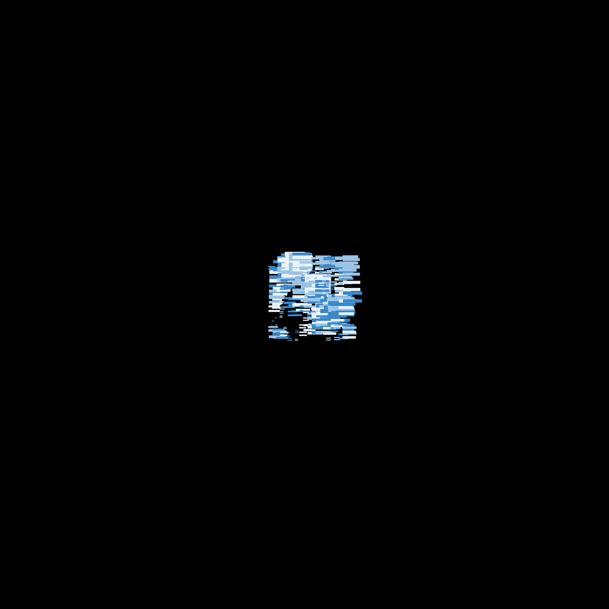

# Canvas playground

Repo dedicated to canvas learning. 🙃

## This repo

- **\_templates**: Some personal templates for 2D and 3D stuff.
- **arts**: some arts, all including their screenshots and their code.

## Arts

```bash
npx canvas-sketch-cli
canvas-sketch [file.js]
```

Runs a server with the file's canvas displayed.

## Some images I've made

With a lot of fun !






