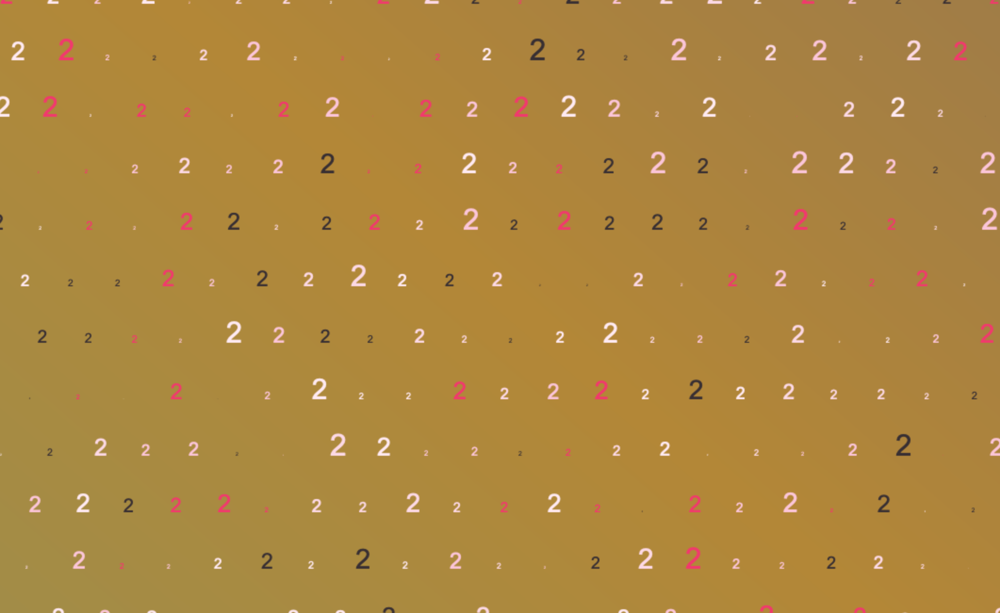

## EduMedia ❤️

Dans `/edumedia` vous trouverez quelques petites choses utilisant _createjs_, mais aussi un peu de canvas plus classique avec les tutoriels de MDN.

Ça ne fonctionnait pas pendant notre entretien parce que je ne pouvais pas me connecter au CDN de _createjs_... 🥺

Si nous n'avions pas manqué de temps, mon partage de connexion n'aurait pas manqué à l'appel !

```bash
npx http-server .
```

Je vous invite aussi à regarder `/arts/2n`, créé pour mon projet [2n](https://github.com/tobudim/2n) (👈 branche _dev_) et mon profil github ! 🙏

Je sais que mon passé n'est pas le plus joli et le plus lisse, mais j'ai fait de mon mieux et je crois qu'aujourd'hui ma force et ma personnalité peuvent beaucoup apporter à votre projet ! 👍



---

# Canvas playground

Repo dedicated to canvas learning. 🙃

## This repo

- **\_templates**: Some personal templates for 2D and 3D stuff.
- **arts**: some arts, all including their screenshots and their code.
- **edumedia**: Hey EduMedia, that's your place! 😉

## Arts

```bash
npx canvas-sketch-cli
canvas-sketch [file.js]
```

Runs a server with the file's canvas displayed.

## Some images I've made

With a lot of fun !


